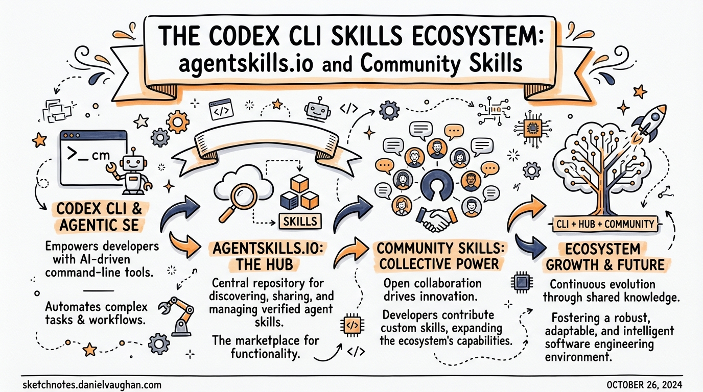

# The Codex CLI Skills Ecosystem: agentskills.io and Community Skills

> 发布时间：2026年3月27日  
> 更新时间：2026年7月20日  
> 标签：ecosystem, skills, plugins, open-source, codex-cli  

## 目录
- [The Codex CLI Skills Ecosystem: agentskills.io and Community Skills](#the-codex-cli-skills-ecosystem-agentskillsio-and-community-skills)
  - [目录](#目录)
  - [Overview](#overview)
  - [What Is the Agent Skills Standard?](#what-is-the-agent-skills-standard)
  - [The SKILL.md Format](#the-skillmd-format)
    - [Trust tiers](#trust-tiers)
    - [Built-in skills](#built-in-skills)
    - [Curated skills catalogue](#curated-skills-catalogue)
    - [Installing skills](#installing-skills)
  - [The skills.sh Ecosystem](#the-skillssh-ecosystem)
    - [Discovery and the leaderboard](#discovery-and-the-leaderboard)
    - [The `npx skills` CLI](#the-npx-skills-cli)
    - [Platform interoperability in practice](#platform-interoperability-in-practice)
  - [Writing Distributable Skills](#writing-distributable-skills)
    - [Structure for progressive disclosure](#structure-for-progressive-disclosure)
    - [Description engineering](#description-engineering)
    - [Scripts as deterministic anchors](#scripts-as-deterministic-anchors)
    - [Validation before publishing](#validation-before-publishing)
    - [Security hygiene](#security-hygiene)
  - [Architectural View: Skills vs MCP](#architectural-view-skills-vs-mcp)
  - [Summary](#summary)
  - [Citations](#citations)
  - [Related Articles](#related-articles)

---



## Overview

Agent Skills 最初是 Anthropic 的内部格式，在 2025 年 12 月作为开放标准发布后的短短几个月内，就成为了整个工具生态中扩展 AI 编码代理能力的主流机制。截至 2026 年初，已有超过 30 个平台支持该格式，包括 Codex CLI、Claude Code、Gemini CLI、GitHub Copilot、Cursor、VS Code、Roo Code、Goose 等。理解这套生态系统，掌握如何高效地编写、发现和安装技能，正逐渐成为大规模运行代理式工作流的团队的核心能力。

本文涵盖 Agent Skills 规范、Codex CLI 的特定集成方式、skills.sh 发现层，以及编写可分发技能的实用模式。

## What Is the Agent Skills Standard?

> ALSO ON THIS TOPIC
>
> --> [Agent Skill Security: The Lifecycle Threat Model Every Codex CLI Developer Needs](https://codex.danielvaughan.com/2026/07/19/agent-skill-security-lifecycle-threat-model-codex-cli-skillmd-plugin-supply-chain-defence/)  
> --> [GuardFall and the Shell Injection Illusion: Why Text-Based Command Filters Fail Every Coding Agent — and How Codex CLI's Kernel-Level Sandbox Renders the Entire Attack Class Irrelevant](https://codex.danielvaughan.com/2026/07/15/guardfall-shell-injection-bypass-open-source-coding-agents-codex-cli-kernel-sandbox-defence/)  
> --> [Inside the Skill Market: What 11,497 SE Skills Reveal About the Gaps in Our Agent Workflows — and How to Fill Them with Codex CLI](https://codex.danielvaughan.com/2026/07/14/inside-the-skill-market-11497-se-skills-codex-cli-lifecycle-gaps-reusable-agent-workflows/)  

Agent Skills 规范由 [agentskills.io](https://agentskills.io/) 负责管理，定义了一种可移植的、基于文件的代理能力打包格式。一个技能就是一个目录，其中至少包含一个 `SKILL.md` 文件。代理在启动时加载技能的元数据，当判定技能与当前任务相关时，再按需加载完整指令。

```
pdf-processing/
├── SKILL.md          # Required: frontmatter + instructions
├── scripts/          # Optional: executable helpers
├── references/       # Optional: long-form reference docs
└── assets/           # Optional: templates, schemas
```

其核心设计原则是**渐进式披露**：启动时仅加载所有技能的 `name` 和 `description`（每个约 100 tokens）；仅当技能被激活时，才加载完整的 `SKILL.md` 正文；而 `scripts/`、`references/` 和 `assets/` 中的文件仅在被显式引用时加载。这意味着你可以安装数十个技能，而不会显著增加会话启动时的上下文体积。

## The SKILL.md Format

`SKILL.md` 文件采用 YAML 前置元数据（frontmatter）+ 自由格式 Markdown 指令的结构：

```markdown
---
name: pdf-processing
description: >
  Extracts text and tables from PDF files, fills PDF forms, and merges
  multiple PDFs. Use when working with PDF documents or when the user
  mentions PDFs, forms, or document extraction.
license: Apache-2.0
compatibility: Requires Python 3.14+ and pdfplumber
metadata:
  author: example-org
  version: "1.0"
allowed-tools: Bash(python3:*) Read Write
---

## Extracting text

Use `scripts/extract.py` to extract plain text from a PDF:

```bash
python3 scripts/extract.py input.pdf > output.txt
```

Merging files
…
```

### Frontmatter fields

| Field | Required | Notes |
|---|---|---|
| `name` | 是 | 1–64 字符，仅支持小写字母、数字、连字符，与目录名一致 |
| `description` | 是 | 1–1024 字符；描述“能做什么”和“何时使用” |
| `license` | 否 | SPDX 许可证标识符，或打包的许可证文件路径 |
| `compatibility` | 否 | 系统要求、适用平台 |
| `metadata` | 否 | 任意键值对映射 |
| `allowed-tools` | 否 | 空格分隔的预批准工具（实验性功能） |

`description` 字段是核心负载：它是代理判断是否隐式激活技能的信号。撰写时要精准——描述任务领域，并包含与用户提示匹配的特定关键词。

`name` 字段必须与父目录名完全一致，并遵循严格的短横线命名（kebab-case）规则：不能有大写字母、不能有连续连字符、不能以连字符开头或结尾。

## Codex CLI Skills Integration

### Installation scan order

Codex 按以下优先级顺序扫描技能目录：

```
$CWD/.agents/skills      # Project-level (highest priority)
$CWD/../.agents/skills   # Parent directory
$REPO_ROOT/.agents/skills # Repository root
$HOME/.agents/skills     # User-level
/etc/codex/skills        # System/admin
Built-in system skills   # Lowest priority
```

这种分层查找是有意设计的：同名技能中，项目级优先级高于用户级，用户级优先级高于系统级。团队可以将技能提交到仓库的 `.agents/skills/` 目录中，实现工作流标准化。

### Invocation policy

默认情况下，当用户提示与技能描述匹配时，Codex 会隐式调用技能。你可以在技能目录内添加 `agents/openai.yaml` 文件，按单个技能禁用该行为：

```yaml
policy:
  allow_implicit_invocation: false
```

禁用隐式调用后，只有当用户使用 `$skillname` 约定显式引用技能名称时，技能才会激活。这适用于敏感或高成本的技能，便于用户显式控制。

### Trust tiers

Codex 将技能分为三个信任层级，由 `$skill-installer` 管理：
- **System** — 由 OpenAI 预装并签名；自动加载
- **Curated** — 经 OpenAI 审核；可通过官方目录按名称安装
- **Experimental** — 社区构建；需要通过完整路径或 URL 显式安装

### Built-in skills

Codex 内置了两个值得了解的系统级技能：
- `$skill-creator` — 交互式搭建新技能；描述你需要的能力，Codex 会自动生成目录结构
- `$skill-installer` — 负责发现、安装、更新、移除的全生命周期管理

### Curated skills catalogue

截至 2026 年 3 月，可通过 `$skill-installer` 获取的官方精选技能包括：

| Skill | Purpose |
|---|---|
| `gh-address-comments` | 处理 GitHub PR 评审评论 |
| `gh-fix-ci` | 诊断并修复失败的 CI 运行 |
| `notion-knowledge-capture` | 将研究与发现保存到 Notion |
| `notion-meeting-intelligence` | 将会议笔记处理为结构化 Notion 页面 |
| `notion-research-documentation` | 在 Notion 中记录研究工作流 |
| `notion-spec-to-implementation` | 基于 Notion 规格文档驱动代码实现 |

位于 `github.com/openai/skills` 的实验性文件夹中还包含 `create-plan`，该技能会指示 Codex 在编写任何文件前先生成结构化计划。

### Installing skills

```bash
# 在 Codex 会话中按名称安装精选技能
$skill-installer gh-fix-ci

# 通过路径安装实验性技能
$skill-installer install https://github.com/openai/skills/tree/main/skills/.experimental/create-plan
```

也可以在不删除技能的情况下禁用它（修改 `config.toml`）：

```toml
# ~/.codex/config.toml
[[skills.config]]
name = "gh-address-comments"
enabled = false
```

修改 `config.toml` 后需重启 Codex。

## The skills.sh Ecosystem

### Discovery and the leaderboard

[skills.sh](https://skills.sh/) 由 Vercel 于 2026 年 1 月 20 日推出，是跨平台技能生态的中央目录与排行榜。它聚合已发布的技能包，按总安装量排名，并提供分类筛选功能。来自 `vercel-labs/agent-skills` 的 Web 开发类（React、Next.js 工具）顶级技能，在发布后数周内累计安装量就已突破 10 万。

### The `npx skills` CLI

`skills` 包管理器是在单一代理原生安装器之外安装社区技能的推荐方式：

```bash
# 列出仓库中可用的技能
npx skills add vercel-labs/agent-skills --list

# 将指定技能安装到指定代理
npx skills add vercel-labs/agent-skills \
  --skill frontend-design \
  --skill skill-creator \
  -a claude-code -a codex

# 全局安装仓库中的所有技能
npx skills add vercel-labs/agent-skills --all -g

# 非交互模式（适用于 CI/CD）
npx skills add vercel-labs/agent-skills \
  --skill frontend-design -g -a claude-code -y
```

该 CLI 支持 GitHub 简写、完整 GitHub URL、GitLab URL、任意 git URL 以及本地路径。`-a codex` 参数会自动将技能安装到 Codex 的预期目录中。

### Platform interoperability in practice

由于 30 多个采用平台都使用相同的 `SKILL.md` 格式，你为 Codex 编写的技能无需修改即可在 Claude Code、Cursor、Gemini CLI、Roo Code 中完全一致地运行。这意味着提交到仓库中的团队技能可以适配任何开发者偏好的工具，大幅降低了在异构团队中管理代理上下文的维护成本。

```
SKILL.md in repo
    ├── Codex CLI
    ├── Claude Code
    ├── Gemini CLI
    ├── Cursor
    ├── GitHub Copilot
    ├── Roo Code
    └── Goose
```

## Writing Distributable Skills

### Structure for progressive disclosure

每个技能 100 token 的启动预算意味着 frontmatter 中的描述必须紧凑而精准。技能正文应控制在 500 行以内；将详细参考资料放入 `references/` 目录：

```
my-skill/
├── SKILL.md             # ≤ 500 lines: core workflow
├── references/
│   ├── REFERENCE.md     # Full API reference; loaded on demand
│   └── EDGE_CASES.md    # Troubleshooting; loaded on demand
└── scripts/
    └── run.py           # Invoked by instructions in SKILL.md
```

### Description engineering

描述同时承担着技能激活触发器和用户文档的作用。一个实用的思路：把它当成路由规则中的 `match` 子句来写。

```yaml
# 过于模糊 — 几乎任何场景都会触发
description: Helps with code tasks.

# 过于狭窄 — 会漏掉合理的触发场景
description: Runs eslint on JavaScript files.

# 校准良好的写法
description: >
  Runs ESLint, Prettier, and TypeScript type checking on JavaScript and
  TypeScript projects. Use when fixing lint errors, enforcing code style,
  checking types, or preparing code for review. Supports flat config
  (eslint.config.js) and legacy .eslintrc formats.
```

### Scripts as deterministic anchors

将复杂的多步操作编码为脚本，而非纯自然语言指令，技能的表现会更好。代理会解释 Markdown 正文，但脚本的执行是确定的：

```python
#!/usr/bin/env python3
# references/run-tests.py
"""Run the full test suite and emit a structured JSON report."""
import subprocess, json, sys

result = subprocess.run(
    ["pytest", "--json-report", "--json-report-file=/tmp/report.json", "-q"],
    capture_output=True, text=True
)

with open("/tmp/report.json") as f:
    report = json.load(f)

print(json.dumps({
    "passed": report["summary"]["passed"],
    "failed": report["summary"]["failed"],
    "errors": [t["nodeid"] for t in report["tests"] if t["outcome"] == "failed"]
}))
```

在 `SKILL.md` 中引用它：

```
Run the test suite and read the JSON output:
scripts/run-tests.py
```

### Validation before publishing

公开发布技能前，使用 `skills-ref` 参考库进行校验：

```bash
npx skills-ref validate ./my-skill
```

该工具会检查 frontmatter 有效性、命名约束以及规范合规性。

### Security hygiene

安全研究人员已在野外发现恶意技能，它们会滥用 `scripts/` 目录或在 `SKILL.md` 正文中嵌入提示注入载荷。对待安装的技能要像对待第三方代码一样：激活前审查 `SKILL.md` 和所有脚本，避免安装来源不可信的技能，优先选择精选层级或知名社区仓库中的技能。

## Architectural View: Skills vs MCP

Skills 和 MCP（Model Context Protocol）解决的是相邻但不同的问题：

**Skills 的运行机制**
1. 代理启动时，若存在技能，仅加载每个技能的名称+描述（每个约 100 tokens）
2. 用户提示到达后，若匹配隐式触发条件，则加载完整 `SKILL.md` 正文到上下文
3. 若用户显式调用 `$skillname`，则直接激活技能
4. 被引用的文件按需加载

技能是懒加载的、基于文本的上下文：代理读取指令，再利用自身能力执行这些指令。

**MCP 的运行机制**
1. 启动时加载所有 Schema 和全部工具
2. 工具调用针对运行中的实时系统执行

MCP 服务器是实时集成：代理调用结构化的工具端点，与运行中的进程交互。

**适用场景区分**
- 用 Skills 处理流程知识与规范约定
- 用 MCP 处理实时数据访问、已认证 API 和有状态操作

## Summary

Agent Skills 生态的整合速度很快。格式已经稳定，跨平台互操作性真实可用，围绕发现和安装的工具体系也已显著成熟。对于 Codex CLI 而言：

1. 将项目级技能提交到仓库的 `.agents/skills/` 目录——整个团队会自动获得一致的代理行为
2. 精选和实验性的 OpenAI 目录技能使用 `$skill-installer`；来自 skills.sh 的社区技能使用 `npx skills`
3. 把描述写成激活触发器，而不是功能摘要
4. `SKILL.md` 控制在 500 行以内；参考资料放到 `references/` 中
5. 确定性步骤优先使用脚本实现，而非纯文字描述
6. 安装来源不可信的技能前，务必审查内容

## Citations

1. Anthropic 于 2025 年 12 月 18 日发布 Agent Skills 开放标准。[*Agent Skills – Overview*](https://agentskills.io/home)
2. 截至 2026 年初，已有超过 30 个代理平台采用 Agent Skills 标准。[agentskills.io/home](https://agentskills.io/home)
3. Agent Skills 规范，包括 SKILL.md 格式、frontmatter 字段、渐进式披露模型以及校验工具。[agentskills.io/specification](https://agentskills.io/specification)
4. Codex CLI `$skill-installer`、信任层级、精选技能目录以及 `config.toml` 禁用方式。[GitHub – openai/skills](https://github.com/openai/skills)
5. Vercel 于 2026 年 1 月 20 日推出 skills.sh 与 `npx skills` CLI。[*Introducing skills, the open agent skills ecosystem – Vercel*](https://vercel.com/changelog/introducing-skills-the-open-agent-skills-ecosystem)
6. 安全研究发现存在利用 `scripts/` 目录和提示注入的恶意技能。⚠️ 相关研究报告未独立验证——仅作为社区报告的方向性参考
7. Skills 与 MCP 的架构差异，基于 Agent Skills 规范中记载的渐进式披露设计。[agentskills.io/specification](https://agentskills.io/specification)

## Related Articles

[The Codex CLI Companion Tools Ecosystem: Token Monitors, Orchestrators, and Community Collections](https://codex.danielvaughan.com/2026/04/29/codex-cli-companion-tools-ecosystem-ccusage-tokscale-orchestrators/)  
[Codex CLI and Vercel: AI Gateway, Skills and the Vercel Plugin Ecosystem](https://codex.danielvaughan.com/2026/03/30/codex-cli-vercel-ai-gateway-skills-plugin/)   
[Codex CLI Plugin System: Bundling Skills, MCP Servers, and App Connectors](https://codex.danielvaughan.com/2026/03/30/codex-cli-plugin-system/)  
[Payload-Less Skill Attacks: What SkillHarm and Semantic Compliance Hijacking Mean for Your Codex CLI Plugin Stack](https://codex.danielvaughan.com/2026/07/11/payload-less-skill-attacks-skillharm-semantic-compliance-hijacking-codex-cli-plugin-defence-approval-sandbox/)  
[CODESKILL and Self-Evolving Skill Banks: What RL-Trained Procedural Skill Management Means for Codex CLI Workflows](https://codex.danielvaughan.com/2026/07/03/codeskill-self-evolving-skill-banks-coding-agents-codex-cli-rl-procedural-skill-management/)  